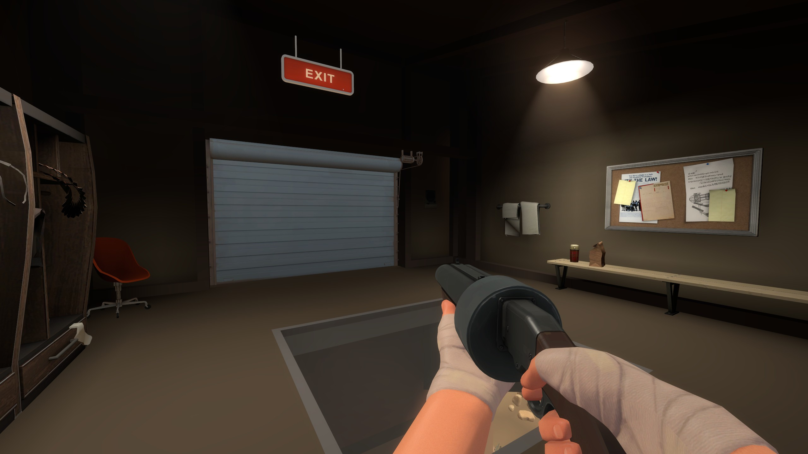
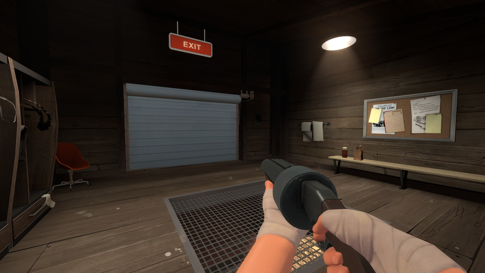
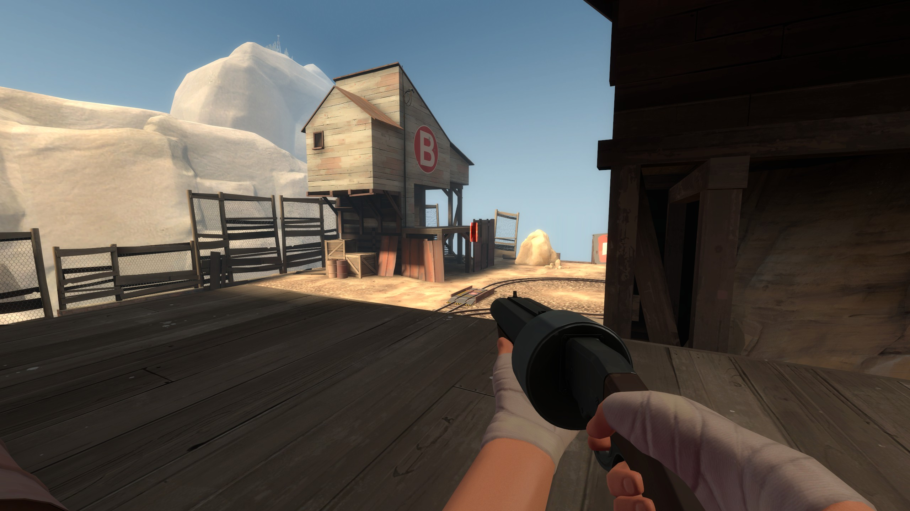
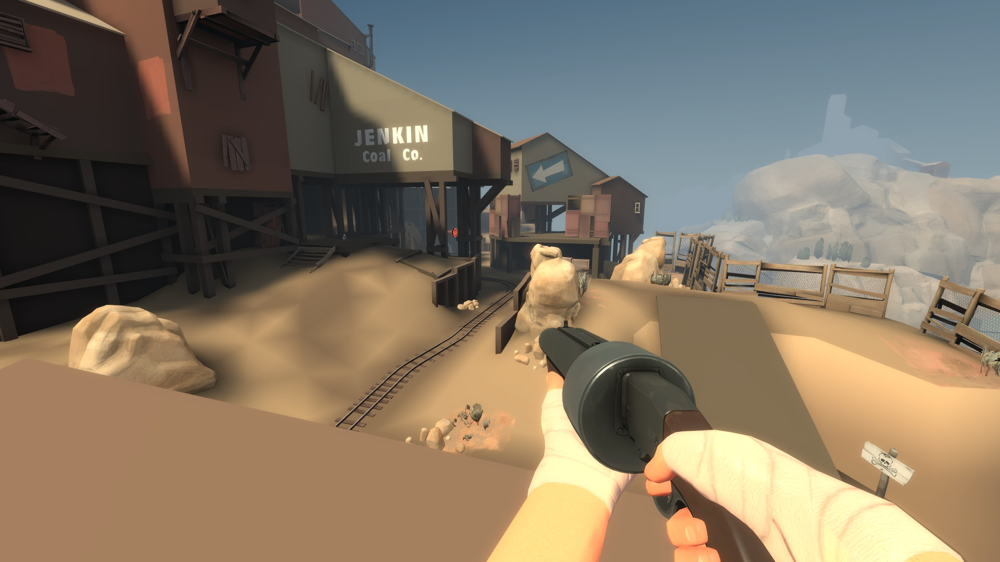
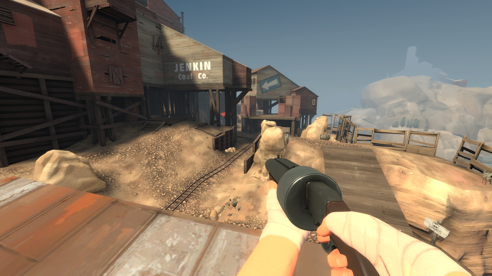

# CleanTF2

A command-line tool that generates flattened textures for Team Fortress 2.
Based on [CleanTF2plus](https://github.com/JarateKing/CleanTF2plus) by [JarateKing](https://github.com/JarateKing).

To download and install the textures, see [Download](#Download). 

## Download

1. View the [latest release](https://github.com/theaswanson/CleanTF2/releases)
2. Download the .vpk files
3. Place in your `../Team Fortress 2/tf/custom` folder

## Using the tool

> Only Windows is supported at this time.

### Prerequisites

Before running the tool, ensure the following files and folders are present:

```text
some-folder/
├─ CleanTF2.CLI.exe
├─ flat.txt
├─ flat_hl2.txt
├─ Magick.Native-Q16-x64.dll
├─ lib/
│  ├─ DevIL.dll
│  ├─ HLExtract.exe
│  ├─ HLLib.dll
│  ├─ VTFCmd.exe
│  ├─ VTFLib.dll
```

- `lib`
  - Folder containing third-party tools ([HLLib](https://developer.valvesoftware.com/wiki/HLLib) and [VTFLib](https://developer.valvesoftware.com/wiki/VTFLib)) that are used to extract and convert TF2's textures.
- `flat.txt`
  - Specifies which TF2 textures to flatten. You can modify this list if you wish.
- `flat_hl2.txt`
  - Specifies which Half-Life 2 textures to flatten. You can modify this list if you wish.
- `Magick.Native-Q16-x64.dll`
  - Third-party tool ([Magick.NET](https://github.com/dlemstra/Magick.NET)) used to flatten the textures.

### Usage

1. Generate the textures
   1. To generate a .vpk with flattened textures: `CleanTF2.CLI.exe flatten`
      1. This will use the default TF2 directory `"C:\Program Files (x86)\Steam\steamapps\common\Team Fortress 2"`
   2. To use a different TF2 folder: `CleanTF2.CLI.exe flatten -d "C:\your\install\directory\for\Team Fortress 2"`
   3. To generate flattened textures to a folder: `CleanTF2.CLI.exe flatten --output-type 2`
2. Move the textures (either the .vpk files or the .vtf files) into the `tf/custom` folder

When using .vpks:

```text
tf/
├─ custom/
│  ├─ flat-textures_000.vpk
│  ├─ flat-textures_dir.vpk
```

When using texture files:

```text
tf/
├─ custom/
│  ├─ flat-textures/
│  │  ├─ materials/
│  │  │  ├─ concrete/
│  │  │  ├─ wall/
│  │  │  ├─ harvest/
│  │  │  ├─ etc./
```

### Command Help Text

```text
USAGE:
    CleanTF2.CLI.exe flatten [OPTIONS]

OPTIONS:
    -h, --help           Prints help information
    -d                   Full path to the Team Fortress 2 directory (the directory that contains the hl2 executable)
        --output-type    1: .vpk files (default), 2: material files
        --upscale        Upscales flattened textures to 1024x1024. Helps address compatibility problems with sv_pure.
                         (warning: takes more file size and processing time)
```

## Images








